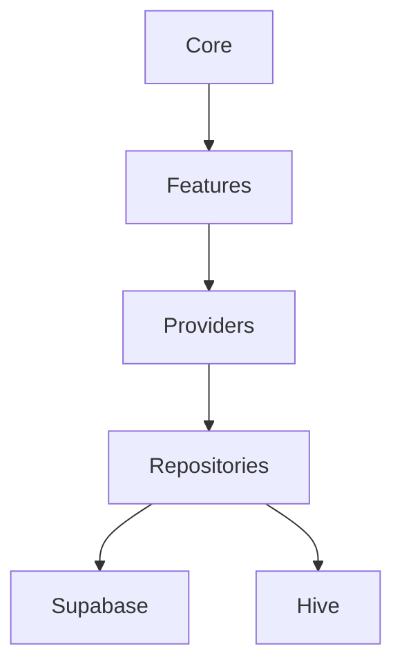

# Project Management App

[](https://flutter.dev/) [](https://riverpod.dev/) [](https://supabase.com/) [](https://sentry.io/) [](https://codecov.io/gh/Steve-Mee/project-management-app)

[](https://opensource.org/licenses/MIT) [](https://github.com/Steve-Mee/project-management-app/stargazers) [](https://github.com/Steve-Mee/project-management-app/network/members) [](https://github.com/Steve-Mee/project-management-app/issues)

## Description

Flutter-based Project Management App for tracking projects, tasks, and sub-tasks. Features AI chat integration, offline Hive storage, Supabase backend, user authentication, roles/permissions, and customizable dashboards. Supports multi-language and desktop/mobile. Built with Riverpod for state management.

## CI/CD

[](https://github.com/Steve-Mee/project-management-app/actions/workflows/flutter_test.yml)
[](https://codecov.io/gh/Steve-Mee/project-management-app)

- `flutter_test.yml`: Runs Flutter analyze, tests with coverage, and web build on pull requests and pushes to `main`.
- `flutter_desktop.yml`: Runs matrix desktop builds for Windows, macOS, and Linux on pull requests and pushes to `main`.
- `semantic_pr.yml`: Validates pull request titles using conventional commit semantics.
- `release.yml`: Runs semantic-release automation on pushes to `main`.

## Screenshots

### Dashboard Light


### Dashboard Dark


### AI Chat


### Gantt Chart


## Gantt Chart (Modern)

The app now uses a modern `gantt_chart`-based timeline wrapper (`ModernGanttChart`) with Riverpod-driven task data.

- Material 3 styling via `Theme.of(context).colorScheme`
- Automatic dark mode support
- Touch gestures:
   - Horizontal pan/scroll on timeline
   - Drag task bars to reschedule (with callback persistence)
- Controls:
   - Zoom in/out
   - Pan left/right
   - Export menu (CSV/PDF via platform share)
- Offline-first data source through Hive-backed repositories and `tasksProvider`

### Offline Mode


### Mobile and Desktop Views


### Deep Link Invite


### Export PDF/CSV


## Architecture

The application follows a clean architecture pattern with the following layers:



- **Core**: Fundamental utilities and shared code
- **Features**: UI and business logic modules
- **Providers**: State management with Riverpod
- **Repositories**: Data access abstraction
- **Supabase/Hive**: External data sources

## Modular Architecture

The app now uses a modular core package (`packages/pma_core`) to separate reusable core logic from app-specific feature UI.

- `pma_core` contains shared providers, services, repository logic, models, utils, and shared widgets
- Feature screens stay in the main app under `lib/features/...` and import shared code via `package:pma_core/...`
- Router-level deferred loading is enabled for feature routes to reduce initial load work

For status and acceptance checklist details, see [`docs/modularization.md`](docs/modularization.md).

## Feature Flags (Supabase)

Issue `#071-feature-flags-supabase` adds a Supabase-backed feature flag system with Hive cache fallback.

- Core service: `packages/pma_core/lib/core/services/feature_flag_service.dart`
- Main Riverpod provider: `packages/pma_core/lib/core/providers/feature_flag_provider.dart`
- Shared resolver/model: `packages/pma_core/lib/core/feature_flags/feature_flag_resolver.dart`, `packages/pma_core/lib/core/feature_flags/feature_flag.dart`
- Admin UI + route: `packages/pma_core/lib/core/widgets/feature_flags_admin.dart`, `lib/core/routes.dart` (`/admin/feature-flags`)
- Legacy compatibility shim: `packages/pma_core/lib/services/ab_testing_service.dart` (deprecated; forwards to feature flags)

Current integrated flags:

- `ai_assistant_enabled`: gates AI chat send/generate actions
- `ai_advanced_planning`: gates planning/proposals/final plan actions
- `gantt_chart_enabled`: controls Gantt screen fallback vs chart UI
- `onboarding_enabled`: controls onboarding wizard display/auto-skip

Operational behavior:

- Cache-first reads with Hive fallback (`feature_flags` box + `last_fetch`)
- Auto-refresh every 30 minutes and refresh on app resume
- Fail-open defaults in UI flows while flags are loading/unavailable
- Supabase RLS-protected writes (JWT `app_metadata.role == 'admin'`)
- Audit events recorded in `analytics` as `feature_flag_changed`

See [`docs/feature-flags.md`](docs/feature-flags.md) for the implementation checklist and acceptance criteria mapping.

## Error Handling

Issue `#072-global-error-boundary` introduces centralized crash handling and Sentry observability.

- Global boundary widget: `lib/core/widgets/error_boundary.dart`
- Bootstrap wiring: `lib/main.dart` (`runZonedGuarded` + root `ErrorBoundary`)
- Sentry wrapper service: `lib/core/services/sentry_service.dart`
- Logger bridge with breadcrumb forwarding: `packages/pma_core/lib/services/app_logger.dart`

Debug validation flags:

- `DEBUG_THROW_STARTUP_ERROR=true`: forces startup exception to validate zone/Sentry capture
- `DEBUG_THROW_POSTFRAME_ERROR=true`: throws post-frame Flutter error to validate boundary fallback UI

Implementation checklist and test steps are documented in [`docs/error-boundary.md`](docs/error-boundary.md).

## Documentation

| File | Description |
|------|-------------|
| [00_START_HERE.md](00_START_HERE.md) | Getting started guide for the project |
| [DASHBOARD_GUIDE.md](DASHBOARD_GUIDE.md) | Guide for using the dashboard features |
| [IMPLEMENTATION_SUMMARY.md](IMPLEMENTATION_SUMMARY.md) | Summary of the implementation details |
| [INTEGRATION_GUIDE.md](INTEGRATION_GUIDE.md) | Guide for integrating various components |
| [docs/gantt-chart.md](docs/gantt-chart.md) | Gantt upgrade checklist, architecture notes, and verification |
| [docs/feature-flags.md](docs/feature-flags.md) | Supabase feature flag checklist, provider/service summary, and acceptance mapping |
| [docs/error-boundary.md](docs/error-boundary.md) | Global error boundary acceptance checklist, test procedure, and AppLogger/Sentry integration notes |
| [docs/modularization.md](docs/modularization.md) | Issue #070 modularization acceptance checklist and deferred routing summary |
| [NAVIGATION_GUIDE.md](NAVIGATION_GUIDE.md) | Guide for navigating the application |
| [QUICK_REFERENCE.md](QUICK_REFERENCE.md) | Quick reference for key features |
| [TODO.md](TODO.md) | List of tasks and todos |
| [REMAINING_TODOS.md](REMAINING_TODOS.md) | Remaining tasks to be completed |
| [FINAL_STATUS.md](FINAL_STATUS.md) | Final status report |
| [FILE_INDEX.md](FILE_INDEX.md) | Index of all project files |

## Features

- 📋 **Project & Task Management**: Create, organize, and track projects with hierarchical tasks and sub-tasks
- 🤖 **AI Chat Integration**: Built-in AI assistant for project insights and task suggestions
- 💾 **Offline Storage**: Local Hive database for offline functionality and data persistence
- 🔄 **Real-time Synchronization**: Instant updates across devices with Supabase real-time
- ☁️ **Cloud Backend**: Supabase integration for collaboration and data synchronization
- 🔐 **User Authentication**: Secure login system with role-based permissions and biometric support
- 💳 **Payment Integration**: Stripe integration for premium features and subscriptions
- 📊 **Customizable Dashboards**: Personalized views and analytics for project tracking
- 📈 **Gantt Charts**: Visual project timelines and scheduling
- 📄 **Export Capabilities**: Export projects to PDF and CSV formats
- 🔗 **Deep Linking**: Share project invites via deep links
- 🌍 **Multi-language Support**: Internationalization with support for multiple languages
- 🖥️ **Cross-platform**: Runs on iOS, Android, Windows, macOS, and Linux
- ⚡ **State Management**: Riverpod for predictable and scalable app state

## Tech Stack

- **Frontend**: Flutter
- **State Management**: Riverpod
- **Local Storage**: Hive
- **Backend**: Supabase
- **Authentication**: Supabase Auth
- **AI Integration**: OpenAI API
- **Internationalization**: Flutter Intl
- **Testing**: Flutter Test, Integration Tests

<!-- Add version badges or more details -->

## Setup

### Prerequisites

- Flutter SDK (3.0+)
- Dart SDK
- Supabase account (for backend)
- OpenAI API key (for AI features)

### Installation

1. Clone the repository:
   ```bash
   git clone <repository-url>
   cd my_project_management_app
   ```

2. Install dependencies:
   ```bash
   flutter pub get
   ```

### Configuration

3. Set up environment variables:
   - Copy `.env.example` to `.env` in the project root
   - Fill in the required values (see `.env.example` for details)
   
   **Required:**
   - `SUPABASE_URL` - Your Supabase project URL
   - `SUPABASE_ANON_KEY` - Your Supabase anonymous key
   
   **Optional:**
   - `OPENAI_API_KEY` - For AI chat features
   - `STRIPE_PUBLISHABLE_KEY` & `STRIPE_SECRET_KEY` - For payment features
   - `SENTRY_DSN` - For error reporting
   - `LOG_LEVEL` - Application logging level
   - `FIREBASE_API_KEY` - For Firebase services

4. Run the app:
   ```bash
   flutter run
   ```

### Accessibility Contrast Checks

Run the WCAG AA theme contrast tests introduced for issue `#068-accessibility-improvements`:

```bash
flutter test test/core/theme_contrast_test.dart
```

Run the same check with coverage output:

```bash
flutter test --coverage test/core/theme_contrast_test.dart
```

### Accessibility

Accessibility implementation and manual validation checklist are documented in [`docs/accessibility.md`](docs/accessibility.md).

Quick commands:

```bash
flutter run --dart-define=ENABLE_SEMANTICS_DEBUGGER=true
flutter test test/core/theme_contrast_test.dart test/features/project/project_views_accessibility_test.dart
```

<!-- Add platform-specific setup instructions -->

## Contributing

We welcome contributions! Please see our [Contributing Guide](CONTRIBUTING.md) for details.

### Development Setup

1. Fork the repository
2. Create a feature branch: `git checkout -b feature/your-feature`
3. Make your changes and add tests
4. Run tests: `flutter test`
5. Submit a pull request

<!-- Add code of conduct, issue templates, etc. -->

## Roadmap

- **Advanced Analytics**: Implement comprehensive reporting and analytics dashboard for project insights
- **Mobile App Stores**: Release native mobile apps on iOS App Store and Google Play Store
- **Third-party Integrations**: Add integrations with tools like Slack, Jira, and Trello
- **Enhanced AI Features**: Expand AI capabilities for project prediction and automated task suggestions

## License

This project is licensed under the MIT License - see the [LICENSE](LICENSE) file for details.

Built with ❤️ using Flutter

## App Size Analysis (Issue #065)

Reference report and raw output template: [`docs/app-size-analysis.md`](docs/app-size-analysis.md)

### Before/After Summary

| Metric | Before | After | Delta | Delta % |
|------|------:|------:|------:|------:|
| APK (armeabi-v7a, MB) | `TBD` | `TBD` | `TBD` | `TBD` |
| APK (arm64-v8a, MB) | `TBD` | `TBD` | `TBD` | `TBD` |
| APK (x86_64, MB) | `TBD` | `TBD` | `TBD` | `TBD` |
| Dart code total | `TBD` | `TBD` | `TBD` | `TBD` |
| Assets total | `TBD` | `TBD` | `TBD` | `TBD` |
| Fonts total | `TBD` | `TBD` | `TBD` | `TBD` |

### Optimizations Performed

- Removed unused icon package: `cupertino_icons` (no `CupertinoIcons` usage).
- Kept Material icons only via `uses-material-design: true` (`Icons.*` is actively used).
- Removed unused dependency: `riverpod` (kept `flutter_riverpod`).
- Removed unused dependency: `dart_openai`.
- Removed unused dependency: `langchain`.
- Removed unused dependency: `langchain_openai`.
- Removed unused dependency: `flutter_ai_agent_tool`.
- Removed unused dependency: `flutter_local_notifications`.
- Removed unused dependency: `timezone`.
- Removed unused dependency: `legacy_gantt_chart` (legacy package no longer used in runtime code).
- Kept only referenced asset configuration in `pubspec.yaml`: `.env`.
- No custom font declarations were present, so no custom font bundles are included.

### Final APK Size Per ABI

| ABI | APK File | Final Size (Bytes) | Final Size (MB) |
|------|------|------:|------:|
| armeabi-v7a | `app-armeabi-v7a-release.apk` | `TBD` | `TBD` |
| arm64-v8a | `app-arm64-v8a-release.apk` | `TBD` | `TBD` |
| x86_64 | `app-x86_64-release.apk` | `TBD` | `TBD` |

### Re-run Analysis

```bash
flutter build apk --analyze-size --split-per-abi
```
