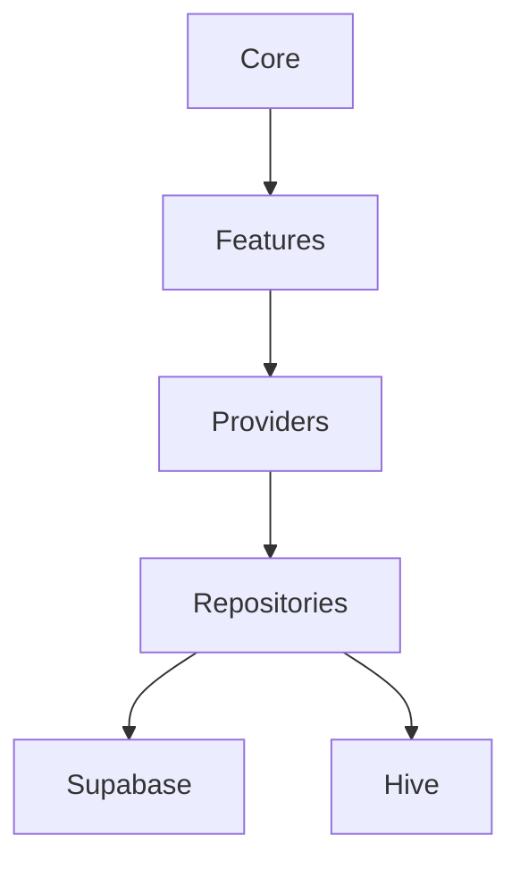

// ARCHITECTURE LOCK: Mirror Gateway = thin proxy only. Compute always on Fly.io or local runner.
# Project Management App

[](https://flutter.dev/) [](https://riverpod.dev/) [](https://supabase.com/) [](https://sentry.io/) [](https://codecov.io/gh/Steve-Mee/project-management-app)

[](https://opensource.org/licenses/MIT) [](https://github.com/Steve-Mee/project-management-app/stargazers) [](https://github.com/Steve-Mee/project-management-app/network/members) [](https://github.com/Steve-Mee/project-management-app/issues)

## Description

Flutter-based Project Management App for tracking projects, tasks, and sub-tasks. Features AI chat integration, offline Hive storage, Supabase backend, user authentication, roles/permissions, and customizable dashboards. Supports multi-language and desktop/mobile. Built with Riverpod for state management.

## CI/CD

[](https://github.com/Steve-Mee/project-management-app/actions/workflows/flutter_test.yml)
[](https://codecov.io/gh/Steve-Mee/project-management-app)

- `flutter_test.yml`: Runs Flutter analyze, tests with coverage, and web build on pull requests and pushes to `main`.
- `flutter_desktop.yml`: Runs matrix desktop builds for Windows, macOS, and Linux on pull requests and pushes to `main`.
- `semantic_pr.yml`: Validates pull request titles using conventional commit semantics.
- `release.yml`: Runs semantic-release automation on pushes to `main`.

## Release Pipeline

Release pipeline documentation for issue `#075-release-pipeline-preparation` is available in [`docs/release-pipeline.md`](docs/release-pipeline.md).

Supabase backend setup, schema, RLS policies, storage bucket guidance, and Supabase function deployment notes are documented in [`docs/supabase-setup.md`](docs/supabase-setup.md).

Quick flow:

1. Conventional Commit merged to `main`.
2. `release.yml` runs semantic-release.
3. semantic-release updates `CHANGELOG.md`, bumps `pubspec.yaml`, and publishes GitHub Release.
4. Published release triggers `fastlane.yml` to distribute iOS TestFlight beta, Android internal track beta, and desktop artifacts.
5. Manual beta distribution is available via `Fastlane Distribution` workflow dispatch.

### Fastlane Release Automation

Issue `#075-release-pipeline-preparation` adds Fastlane lanes for iOS, Android, and desktop release builds.

- Fastlane configuration: `fastlane/Fastfile`
- Fastlane app metadata defaults: `fastlane/Appfile`
- Ruby dependencies: `Gemfile`, `fastlane/Pluginfile`

Available lanes:

- `bundle exec fastlane beta`: Runs iOS TestFlight internal upload + Android internal track upload + desktop (macOS/Windows) builds.
- `bundle exec fastlane release`: Runs iOS App Store Connect upload + Android production upload + desktop (macOS/Windows) builds.
- `bundle exec fastlane ios beta`: iOS internal beta only.
- `bundle exec fastlane android beta`: Android internal beta only.
- `bundle exec fastlane desktop_beta`: Desktop release artifacts only.

Required environment variables:

- `IOS_APP_IDENTIFIER`: iOS bundle ID (example: `com.example.projectManagementApp`).
- `APPLE_ID`: Apple developer account email.
- `APPLE_TEAM_ID`: Apple developer team ID.
- `ANDROID_PACKAGE_NAME`: Android application ID.
- `SUPPLY_JSON_KEY`: Absolute path to Google Play service account JSON key file.

## Screenshots

The repository currently contains four screenshot assets in `images/`.

### Dashboard Overview


### Project Workspace


### Planning And Tracking


### Team Collaboration


## Gantt Chart (Modern)

The app now uses a modern `gantt_chart`-based timeline wrapper (`ModernGanttChart`) with Riverpod-driven task data.

- Material 3 styling via `Theme.of(context).colorScheme`
- Automatic dark mode support
- Touch gestures:
   - Horizontal pan/scroll on timeline
   - Drag task bars to reschedule (with callback persistence)
- Controls:
   - Zoom in/out
   - Pan left/right
   - Export menu (CSV/PDF via platform share)
- Offline-first data source through Hive-backed repositories and `tasksProvider`

Planned screenshot coverage (offline mode, deep link invites, export flows, and platform-specific views) remains on the roadmap and will be added as assets are captured.

## Architecture

The application follows a clean architecture pattern with the following layers:



- **Core**: Fundamental utilities and shared code
- **Features**: UI and business logic modules
- **Providers**: State management with Riverpod
- **Repositories**: Data access abstraction
- **Supabase/Hive**: External data sources

## Mirror Runtime

Mirror compute forwarding now uses action-consistent HTTP endpoints and runner parity across environments.

- Mirror Gateway (thin proxy only) forwards by action to `/compile` or `/apply`.
- Cloud and local mirror runners expose HTTP `/compile` and `/apply` gateways backed by internal gRPC services.
- Shared gateway implementation lives in `server/mirror-shared/lib/http_gateway.dart` and is reused by both runners.
- Apply history and apply audit persistence use encrypted Hive storage, with production fail-closed behavior when encryption initialization fails.
- Canonical Mirror storage buckets are `mirror-signed-inputs` and `mirror-backups`; legacy names such as `mirror_staging` are non-canonical.
- Operational and security contracts are documented in `docs/mirror-ops-runbook.md`, `docs/mirror-bucket-contract.md`, and `docs/mirror-threat-model.md`.

## Modular Architecture

The app now uses a modular core package (`packages/pma_core`) to separate reusable core logic from app-specific feature UI.

- `pma_core` contains shared providers, services, repository logic, models, utils, and shared widgets
- Feature screens stay in the main app under `lib/features/...` and import shared code via `package:pma_core/...`
- Router-level deferred loading is enabled for feature routes to reduce initial load work

For status and acceptance checklist details, see [`docs/modularization.md`](docs/modularization.md).

## Feature Flags (Supabase)

Issue `#071-feature-flags-supabase` adds a Supabase-backed feature flag system with Hive cache fallback.

- Core service: `packages/pma_core/lib/core/services/feature_flag_service.dart`
- Main Riverpod provider: `packages/pma_core/lib/core/providers/feature_flag_provider.dart`
- Shared resolver/model: `packages/pma_core/lib/core/feature_flags/feature_flag_resolver.dart`, `packages/pma_core/lib/core/feature_flags/feature_flag.dart`
- Admin UI + route: `packages/pma_core/lib/core/widgets/feature_flags_admin.dart`, `lib/core/routes.dart` (`/admin/feature-flags`)
- Legacy compatibility shim: `packages/pma_core/lib/services/ab_testing_service.dart` (deprecated; forwards to feature flags)

Current integrated flags:

- `ai_assistant_enabled`: gates AI chat send/generate actions
- `ai_advanced_planning`: gates planning/proposals/final plan actions
- `gantt_chart_enabled`: controls Gantt screen fallback vs chart UI
- `onboarding_enabled`: controls onboarding wizard display/auto-skip

Operational behavior:

- Cache-first reads with Hive fallback (`feature_flags` box + `last_fetch`)
- Auto-refresh every 30 minutes and refresh on app resume
- Fail-open defaults in UI flows while flags are loading/unavailable
- Supabase RLS-protected writes (JWT `app_metadata.role == 'admin'`)
- Audit events recorded in `analytics_events` as `feature_flag_changed`

See [`docs/feature-flags.md`](docs/feature-flags.md) for the implementation checklist and acceptance criteria mapping.

## Analytics

Issue `#073-analytics-implementation` introduces a backend-agnostic analytics layer.

- Abstract contract: `packages/pma_core/lib/core/services/analytics_service.dart` (`AnalyticsService`)
- Default implementation: `SupabaseAnalyticsService`
- Riverpod provider: `analyticsServiceProvider` in `packages/pma_core/lib/core/providers.dart`
- Tracked issue events: `project_created`, `task_completed`, `ai_used`, `invite_sent`

Implementation details, event mapping, and schema suggestions are documented in [`docs/analytics.md`](docs/analytics.md).
AI usage source-of-truth boundaries are documented in [`docs/ai-usage-data-contract.md`](docs/ai-usage-data-contract.md).

## Error Handling

Issue `#072-global-error-boundary` introduces centralized crash handling and Sentry observability.

- Global boundary widget: `lib/core/widgets/error_boundary.dart`
- Bootstrap wiring: `lib/main.dart` (`runZonedGuarded` + root `ErrorBoundary`)
- Sentry wrapper service: `lib/core/services/sentry_service.dart`
- Logger bridge with breadcrumb forwarding: `packages/pma_core/lib/services/app_logger.dart`

Debug validation flags:

- `DEBUG_THROW_STARTUP_ERROR=true`: forces startup exception to validate zone/Sentry capture
- `DEBUG_THROW_POSTFRAME_ERROR=true`: throws post-frame Flutter error to validate boundary fallback UI

Implementation checklist and test steps are documented in [`docs/error-boundary.md`](docs/error-boundary.md).

## PWA Support

Issue `#074-pwa-support-web` adds explicit web PWA support assets and offline behavior.

- Manifest: `web/manifest.json`
- Service worker strategy: Flutter-generated `flutter_service_worker.js` (single-worker setup)
- Bootstrap integration: `web/index.html` -> `flutter_bootstrap.js`
- Build command: `flutter build web --release --pwa-strategy=offline-first`

For acceptance checklist, verification flow, and install steps, see [`docs/pwa-support.md`](docs/pwa-support.md).

## Documentation

| File | Description |
|------|-------------|
| [00_START_HERE.md](00_START_HERE.md) | Getting started guide for the project |
| [DASHBOARD_GUIDE.md](DASHBOARD_GUIDE.md) | Guide for using the dashboard features |
| [IMPLEMENTATION_SUMMARY.md](IMPLEMENTATION_SUMMARY.md) | Summary of the implementation details |
| [INTEGRATION_GUIDE.md](INTEGRATION_GUIDE.md) | Guide for integrating various components |
| [docs/gantt-chart.md](docs/gantt-chart.md) | Gantt upgrade checklist, architecture notes, and verification |
| [docs/feature-flags.md](docs/feature-flags.md) | Supabase feature flag checklist, provider/service summary, and acceptance mapping |
| [docs/supabase-setup.md](docs/supabase-setup.md) | Supabase setup instructions, SQL schema, RLS/storage policies, Supabase functions, and policy authoring guide |
| [docs/analytics.md](docs/analytics.md) | Issue #073 analytics checklist, event mapping, service usage, and `analytics_events` schema suggestion |
| [docs/ai-usage-data-contract.md](docs/ai-usage-data-contract.md) | Authoritative source-of-truth contract for AI usage aggregates (Supabase) versus detailed history (Hive) |
| [docs/error-boundary.md](docs/error-boundary.md) | Global error boundary acceptance checklist, test procedure, and AppLogger/Sentry integration notes |
| [docs/pwa-support.md](docs/pwa-support.md) | Issue #074 PWA checklist, offline test steps, and Chrome install instructions |
| [docs/release-pipeline.md](docs/release-pipeline.md) | Issue #075 release checklist, semantic-release/Fastlane flow, manual beta trigger, and secrets |
| [docs/release-hardening-checklist.md](docs/release-hardening-checklist.md) | Handover checklist met Done/Pending External, secrets en go-live sign-off |
| [docs/modularization.md](docs/modularization.md) | Issue #070 modularization acceptance checklist and deferred routing summary |
| [docs/mirror-production-readiness-checklist.md](docs/mirror-production-readiness-checklist.md) | Mirror production readiness gate with owner/deadline tracking |
| [docs/mirror-ops-runbook.md](docs/mirror-ops-runbook.md) | Mirror compile/apply operations runbook, triage, and rollback flow |
| [docs/mirror-bucket-contract.md](docs/mirror-bucket-contract.md) | Canonical Mirror bucket naming and object path contract |
| [docs/mirror-threat-model.md](docs/mirror-threat-model.md) | Mirror threat scenarios and required controls for signed URLs, tokens, runner exposure, and replay |
| [docs/model-location-policy.md](docs/model-location-policy.md) | Canonical model ownership policy (`pma_core` as source of truth) and de-duplication plan |
| [docs/provider-import-migration.md](docs/provider-import-migration.md) | Canonical provider import paths and phased migration guidance for legacy compatibility barrels |
| [docs/legacy-ui-kit-removal.md](docs/legacy-ui-kit-removal.md) | Issue #056 migration note and replacement checklist for removing legacy UI kit/GetX usage |
| [docs/supabase_fcm_setup.md](docs/supabase_fcm_setup.md) | Issue #058 end-to-end Supabase function to FCM setup, payload shape, and production checklist |
| [docs/golden-tests.md](docs/golden-tests.md) | Issue #060 local golden-test workflow, baseline update flow, and review checklist |
| [docs/ci-cd-workflows.md](docs/ci-cd-workflows.md) | Issue #061 workflow matrix with triggers, responsibilities, and release gating notes |
| [NAVIGATION_GUIDE.md](NAVIGATION_GUIDE.md) | Guide for navigating the application |
| [QUICK_REFERENCE.md](QUICK_REFERENCE.md) | Quick reference for key features |
| [TODO.md](TODO.md) | List of tasks and todos |
| [REMAINING_TODOS.md](REMAINING_TODOS.md) | Remaining tasks to be completed |
| [FINAL_STATUS.md](FINAL_STATUS.md) | Final status report |
| [FILE_INDEX.md](FILE_INDEX.md) | Index of all project files |

## Features

- 📋 **Project & Task Management**: Create, organize, and track projects with hierarchical tasks and sub-tasks
- 🤖 **AI Chat Integration**: Built-in AI assistant for project insights and task suggestions
- 💾 **Offline Storage**: Local Hive database for offline functionality and data persistence
- 🔄 **Real-time Synchronization**: Instant updates across devices with Supabase real-time
- ☁️ **Cloud Backend**: Supabase integration for collaboration and data synchronization
- 🔐 **User Authentication**: Secure login system with role-based permissions and biometric support
- 💳 **Payment Integration**: Stripe integration for premium features and subscriptions
- 📊 **Customizable Dashboards**: Personalized views and analytics for project tracking
- 📈 **Gantt Charts**: Visual project timelines and scheduling
- 📄 **Export Capabilities**: Export projects to PDF and CSV formats
- 🔗 **Deep Linking**: Share project invites via deep links
- 🌍 **Multi-language Support**: Internationalization with support for multiple languages
- 🖥️ **Cross-platform**: Runs on iOS, Android, Windows, macOS, and Linux
- ⚡ **State Management**: Riverpod for predictable and scalable app state

## Tech Stack

- **Frontend**: Flutter
- **State Management**: Riverpod
- **Local Storage**: Hive
- **Backend**: Supabase
- **Authentication**: Supabase Auth
- **AI Integration**: OpenAI API
- **Internationalization**: Flutter Intl
- **Testing**: Flutter Test, Integration Tests

<!-- Add version badges or more details -->

## Setup

### Prerequisites

- Flutter SDK (3.0+)
- Dart SDK
- Supabase account (for backend)
- OpenAI API key (for AI features)

### Installation

1. Clone the repository:
   ```bash
   git clone <repository-url>
   cd my_project_management_app
   ```

2. Install dependencies:
   ```bash
   flutter pub get
   ```

3. Install Fastlane dependencies:
   ```bash
   bundle install
   ```

### Configuration

4. Set up environment variables:
   - Copy `.env.example` to `.env` in the project root
   - Fill in the required values (see `.env.example` for details)
   
   **Required:**
   - `SUPABASE_URL` - Your Supabase project URL
   - `SUPABASE_ANON_KEY` - Your Supabase anonymous key
   
   **Optional:**
   - `OPENAI_API_KEY` - For AI chat features
   - `STRIPE_PUBLISHABLE_KEY` & `STRIPE_SECRET_KEY` - For payment features
   - `SENTRY_DSN` - For error reporting
   - `LOG_LEVEL` - Application logging level
   - `FIREBASE_API_KEY` - For Firebase services

5. Run the app:
   ```bash
   flutter run
   ```

### Fastlane Setup And Usage

1. Install Ruby + Bundler.
2. Run `bundle install` at repository root.
3. Export required env vars (`IOS_APP_IDENTIFIER`, `APPLE_ID`, `APPLE_TEAM_ID`, `ANDROID_PACKAGE_NAME`, `SUPPLY_JSON_KEY`).
4. Run beta pipeline: `bundle exec fastlane beta`.
5. Run production pipeline: `bundle exec fastlane release`.

### GitHub Actions Secrets (Repository Settings)

Add these in `Settings -> Secrets and variables -> Actions`.

iOS / TestFlight:

- `IOS_APP_IDENTIFIER`
- `APPLE_ID`
- `APPLE_TEAM_ID`
- `APP_STORE_CONNECT_API_KEY_ID`
- `APP_STORE_CONNECT_API_ISSUER_ID`
- `APP_STORE_CONNECT_API_KEY_CONTENT`
- `IOS_P12_BASE64`
- `IOS_P12_PASSWORD`
- `IOS_MOBILEPROVISION_BASE64`
- `TESTFLIGHT_INTERNAL_GROUPS` (comma-separated group names, e.g. `QA,Product`)

Android / Google Play Internal Track:

- `ANDROID_PACKAGE_NAME`
- `SUPPLY_JSON_KEY_BASE64`
- `ANDROID_KEYSTORE_BASE64`
- `ANDROID_KEYSTORE_PASSWORD`
- `ANDROID_KEY_ALIAS`
- `ANDROID_KEY_PASSWORD`

Semantic Release:

- `GITHUB_TOKEN` (provided automatically by GitHub Actions)

Notes:

- iOS lanes require macOS with Xcode and valid signing configured.
- Windows/macOS desktop lanes build artifacts only; publishing is handled outside Fastlane.

### Accessibility Contrast Checks

Run the WCAG AA theme contrast tests introduced for issue `#068-accessibility-improvements`:

```bash
flutter test test/core/theme_contrast_test.dart
```

Run the same check with coverage output:

```bash
flutter test --coverage test/core/theme_contrast_test.dart
```

### Golden Tests

Run all golden tests:

```bash
flutter test --tags=golden
```

Update golden baselines when a visual change is intentional:

```bash
UPDATE_GOLDENS=1 flutter test --tags=golden
```

Detailed guide: [`docs/golden-tests.md`](docs/golden-tests.md)

### Accessibility

Accessibility implementation and manual validation checklist are documented in [`docs/accessibility.md`](docs/accessibility.md).

Quick commands:

```bash
flutter run --dart-define=ENABLE_SEMANTICS_DEBUGGER=true
flutter test test/core/theme_contrast_test.dart test/features/project/project_views_accessibility_test.dart
```

### PWA Support

PWA setup and offline-mode verification are documented in [`docs/pwa-support.md`](docs/pwa-support.md), including CI validation coverage (manifest link, service worker registration, cache creation, offline reload).

<!-- Add platform-specific setup instructions -->

## Contributing

We welcome contributions! Please see our [Contributing Guide](CONTRIBUTING.md) for details.

### Development Setup

1. Fork the repository
2. Create a feature branch: `git checkout -b feature/your-feature`
3. Make your changes and add tests
4. Run tests: `flutter test`
5. Submit a pull request

<!-- Add code of conduct, issue templates, etc. -->

## Roadmap

- **Advanced Analytics**: Implement comprehensive reporting and analytics dashboard for project insights
- **Mobile App Stores**: Release native mobile apps on iOS App Store and Google Play Store
- **Third-party Integrations**: Add integrations with tools like Slack, Jira, and Trello
- **Enhanced AI Features**: Expand AI capabilities for project prediction and automated task suggestions

## License

This project is licensed under the MIT License - see the [LICENSE](LICENSE) file for details.

Built with ❤️ using Flutter

## App Size Analysis (Issue #065)

Reference report and raw output template: [`docs/app-size-analysis.md`](docs/app-size-analysis.md)

### Before/After Summary

| Metric | Before | After | Delta | Delta % |
|------|------:|------:|------:|------:|
| APK (armeabi-v7a, MB) | `n/a` | `35.00` | `n/a` | `n/a` |
| APK (arm64-v8a, MB) | `n/a` | `36.94` | `n/a` | `n/a` |
| APK (x86_64, MB) | `n/a` | `38.48` | `n/a` | `n/a` |
| Dart code total | `n/a` | `~13-14 MB` | `n/a` | `n/a` |
| Assets total | `n/a` | `~143 KB` | `n/a` | `n/a` |
| Fonts total | `n/a` | `~16.9 KB` | `n/a` | `n/a` |

### Optimizations Performed

- Removed unused icon package: `cupertino_icons` (no `CupertinoIcons` usage).
- Kept Material icons only via `uses-material-design: true` (`Icons.*` is actively used).
- Removed unused dependency: `riverpod` (kept `flutter_riverpod`).
- Removed unused dependency: `dart_openai`.
- Removed unused dependency: `langchain`.
- Removed unused dependency: `langchain_openai`.
- Removed unused dependency: `flutter_ai_agent_tool`.
- Removed unused dependency: `flutter_local_notifications`.
- Removed unused dependency: `timezone`.
- Removed unused dependency: `legacy_gantt_chart` (legacy package no longer used in runtime code).
- Kept only referenced asset configuration in `pubspec.yaml`: `.env`.
- No custom font declarations were present, so no custom font bundles are included.

### Final APK Size Per ABI

| ABI | APK File | Final Size (Bytes) | Final Size (MB) |
|------|------|------:|------:|
| armeabi-v7a | `app-armeabi-v7a-release.apk` | `35000254` | `35.00` |
| arm64-v8a | `app-arm64-v8a-release.apk` | `36940534` | `36.94` |
| x86_64 | `app-x86_64-release.apk` | `38483552` | `38.48` |

### Re-run Analysis

```bash
flutter build apk --analyze-size --target-platform android-arm
flutter build apk --analyze-size --target-platform android-arm64
flutter build apk --analyze-size --target-platform android-x64
flutter build apk --split-per-abi
```

## Mirror Editor

The Mirror Editor is a focused workspace for AI-assisted task execution with project and task context preloaded.

### What It Does

- Opens directly from Project and Task contexts using deep-link actions.
- Loads the selected `projectId` and `taskId` into a dedicated coding workspace.
- Supports voice input, live output monitoring, and a multi-file editing surface.

### Modes

Mirror Editor supports two runtime modes:

- `Private Mode`:
   - Local-first behavior for speed and privacy.
   - Suitable for day-to-day task drafting and iteration.
- `Cloud Mode`:
   - Designed for premium users and collaborative/cloud-assisted workflows.
   - Uses premium-gated capabilities where applicable.

Mode selection is persisted and can fall back to cached state when offline.

### Premium Access

- Cloud mode and selected advanced Mirror capabilities are premium-gated.
- Access checks are enforced via role/permission and premium-state providers.
- If a user lacks access, the app keeps the flow safe and non-destructive (for example, disabled action or informational message).

### Safety And Guardrails

Mirror Editor is designed with operational safety in mind:

- Permission-gated entry (`use_mirror`) before launch.
- Defensive fallbacks for temporary backend/network failures.
- Offline cache fallback for mode and variant continuity.
- Non-blocking warning surfaces instead of hard crashes.
- Existing app-wide error boundary and telemetry integration remain active.

### A/B Experience

- Team mode experiments are assigned deterministically per user.
- Variant assignment supports offline fallback to cached values.
- Behavior remains stable between sessions unless experiment definitions change.

### Offline Behavior

- Last-known Mirror mode is stored locally and restored on next launch.
- Team-mode variant can be restored from local cache when assignment service is unavailable.
- User receives contextual warning state when fallback is active.

### In-App Entry Points

- `Project Details`: direct action to open Mirror Editor with project/task context.
- `Task Card`: direct action to open Mirror Editor from the selected task.

These entry points route through a bridge provider that prepares Mirror state before navigation.

External deep-link handling in `lib/main.dart` currently targets invitation acceptance (`/accept-invite`).

### Screenshots (Placeholders)

Add final product screenshots here when available:

- `images/mirror-editor-overview.png` - Main Mirror workspace layout.
- `images/mirror-editor-mode-selector.png` - Private vs Cloud mode selector.
- `images/mirror-editor-project-task-context.png` - Project/task context header.
- `images/mirror-editor-offline-warning.png` - Offline fallback warning state.
- `images/mirror-editor-voice-input.png` - Voice input interaction.

Example markdown once assets are added:

```md


```

### Related Files

- `lib/features/mirror/mirror_editor_screen.dart`
- `lib/core/providers/mirror_provider.dart`
- `lib/core/providers/ai_chat_provider.dart`
- `lib/features/project/project_detail_screen.dart`
- `lib/features/project/expandable_task_card.dart`
