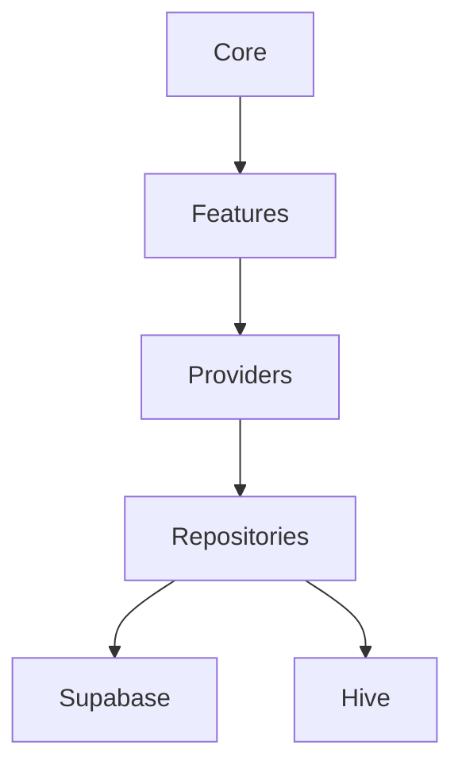

# Project Management App

[](https://flutter.dev/) [](https://riverpod.dev/) [](https://supabase.com/) [](https://sentry.io/) [](https://codecov.io/gh/Steve-Mee/project-management-app)

[](https://opensource.org/licenses/MIT) [](https://github.com/Steve-Mee/project-management-app/stargazers) [](https://github.com/Steve-Mee/project-management-app/network/members) [](https://github.com/Steve-Mee/project-management-app/issues)

## Description

Flutter-based Project Management App for tracking projects, tasks, and sub-tasks. Features AI chat integration, offline Hive storage, Supabase backend, user authentication, roles/permissions, and customizable dashboards. Supports multi-language and desktop/mobile. Built with Riverpod for state management.

## Screenshots

### Dashboard Light


### Dashboard Dark


### AI Chat


### Gantt Chart


### Offline Mode


### Mobile and Desktop Views


### Deep Link Invite


### Export PDF/CSV


## Architecture

The application follows a clean architecture pattern with the following layers:



- **Core**: Fundamental utilities and shared code
- **Features**: UI and business logic modules
- **Providers**: State management with Riverpod
- **Repositories**: Data access abstraction
- **Supabase/Hive**: External data sources

## Documentation

| File | Description |
|------|-------------|
| [00_START_HERE.md](00_START_HERE.md) | Getting started guide for the project |
| [DASHBOARD_GUIDE.md](DASHBOARD_GUIDE.md) | Guide for using the dashboard features |
| [IMPLEMENTATION_SUMMARY.md](IMPLEMENTATION_SUMMARY.md) | Summary of the implementation details |
| [INTEGRATION_GUIDE.md](INTEGRATION_GUIDE.md) | Guide for integrating various components |
| [NAVIGATION_GUIDE.md](NAVIGATION_GUIDE.md) | Guide for navigating the application |
| [QUICK_REFERENCE.md](QUICK_REFERENCE.md) | Quick reference for key features |
| [TODO.md](TODO.md) | List of tasks and todos |
| [REMAINING_TODOS.md](REMAINING_TODOS.md) | Remaining tasks to be completed |
| [FINAL_STATUS.md](FINAL_STATUS.md) | Final status report |
| [FILE_INDEX.md](FILE_INDEX.md) | Index of all project files |

## Features

- 📋 **Project & Task Management**: Create, organize, and track projects with hierarchical tasks and sub-tasks
- 🤖 **AI Chat Integration**: Built-in AI assistant for project insights and task suggestions
- 💾 **Offline Storage**: Local Hive database for offline functionality and data persistence
- 🔄 **Real-time Synchronization**: Instant updates across devices with Supabase real-time
- ☁️ **Cloud Backend**: Supabase integration for collaboration and data synchronization
- 🔐 **User Authentication**: Secure login system with role-based permissions and biometric support
- 💳 **Payment Integration**: Stripe integration for premium features and subscriptions
- 📊 **Customizable Dashboards**: Personalized views and analytics for project tracking
- 📈 **Gantt Charts**: Visual project timelines and scheduling
- 📄 **Export Capabilities**: Export projects to PDF and CSV formats
- 🔗 **Deep Linking**: Share project invites via deep links
- 🌍 **Multi-language Support**: Internationalization with support for multiple languages
- 🖥️ **Cross-platform**: Runs on iOS, Android, Windows, macOS, and Linux
- ⚡ **State Management**: Riverpod for predictable and scalable app state

## Tech Stack

- **Frontend**: Flutter
- **State Management**: Riverpod
- **Local Storage**: Hive
- **Backend**: Supabase
- **Authentication**: Supabase Auth
- **AI Integration**: OpenAI API
- **Internationalization**: Flutter Intl
- **Testing**: Flutter Test, Integration Tests

<!-- Add version badges or more details -->

## Setup

### Prerequisites

- Flutter SDK (3.0+)
- Dart SDK
- Supabase account (for backend)
- OpenAI API key (for AI features)

### Installation

1. Clone the repository:
   ```bash
   git clone <repository-url>
   cd my_project_management_app
   ```

2. Install dependencies:
   ```bash
   flutter pub get
   ```

### Configuration

3. Set up environment variables:
   - Copy `.env.example` to `.env` in the project root
   - Fill in the required values (see `.env.example` for details)
   
   **Required:**
   - `SUPABASE_URL` - Your Supabase project URL
   - `SUPABASE_ANON_KEY` - Your Supabase anonymous key
   
   **Optional:**
   - `OPENAI_API_KEY` - For AI chat features
   - `STRIPE_PUBLISHABLE_KEY` & `STRIPE_SECRET_KEY` - For payment features
   - `SENTRY_DSN` - For error reporting
   - `LOG_LEVEL` - Application logging level
   - `FIREBASE_API_KEY` - For Firebase services

4. Run the app:
   ```bash
   flutter run
   ```

<!-- Add platform-specific setup instructions -->

## Contributing

We welcome contributions! Please see our [Contributing Guide](CONTRIBUTING.md) for details.

### Development Setup

1. Fork the repository
2. Create a feature branch: `git checkout -b feature/your-feature`
3. Make your changes and add tests
4. Run tests: `flutter test`
5. Submit a pull request

<!-- Add code of conduct, issue templates, etc. -->

## Roadmap

- **Advanced Analytics**: Implement comprehensive reporting and analytics dashboard for project insights
- **Mobile App Stores**: Release native mobile apps on iOS App Store and Google Play Store
- **Third-party Integrations**: Add integrations with tools like Slack, Jira, and Trello
- **Enhanced AI Features**: Expand AI capabilities for project prediction and automated task suggestions

## License

This project is licensed under the MIT License - see the [LICENSE](LICENSE) file for details.

Built with ❤️ using Flutter
