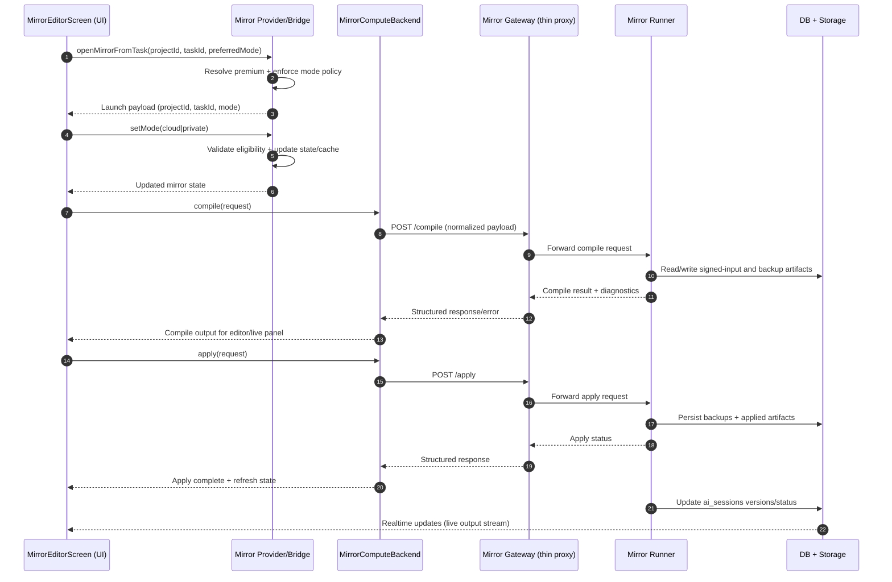

// ARCHITECTURE LOCK: Mirror Gateway = thin proxy only. Compute always on Fly.io or local runner.
# Mirror Architecture

## Purpose
Mirror provides an assisted coding workspace inside the app, combining UI controls, provider-driven mode selection, backend compute execution, and persistent storage of session/version metadata.

This document describes the end-to-end runtime path and the key responsibilities per layer.

## Scope
The architecture in this document covers:

- Mirror Editor UI (`MirrorEditorScreen`)
- Mirror state and backend selection (`mirrorProvider`, `mirrorBackendProvider`)
- Compute backend contract (`MirrorComputeBackend`) and concrete backends
- Mirror Gateway routing (`mirror-gateway`, thin proxy only)
- Runner execution service (cloud/local runner)
- Storage and session persistence (`ai_sessions`, `mirror-signed-inputs`, `mirror-backups`)

## Components

### UI Layer
- Entry points: task/project actions that deep-link to `MirrorEditorScreen`
- Main screen: `lib/features/mirror/mirror_editor_screen.dart`
- Supporting services (extracted from screen — screen is pure UI wiring only):
  - `MirrorEditorRealtimeController` (`services/mirror_editor_realtime_controller.dart`) — owns Supabase Realtime channel subscription, broadcast dedup, and debug-stream injection
  - `MirrorEditorRunService` (`services/mirror_editor_run_service.dart`) — owns run lifecycle (in-progress guard + delegate to `MirrorEditorOrchestrationService`)
  - `MirrorEditorOrchestrationService` (`services/mirror_editor_orchestration_service.dart`) — generate/compile/preview/apply pipeline
  - `MirrorRealtimeEventSetDeduplicator` (in `mirror_realtime_service.dart`) — FIFO-bounded set dedup for broadcast events
- Responsibilities:
  - Select mode (`private` or `cloud`)
  - Show premium guard UX for restricted mode
  - Display files/editor/terminal/live output
  - Forward user intent to provider/service flow; all orchestration and realtime logic is delegated to the above services

### Provider Layer
- State provider: `lib/core/providers/mirror_provider.dart`
- Bridge provider: `lib/core/providers/ai_chat_provider.dart` (`openMirrorFromTask`)
- Responsibilities:
- Resolve premium status and mode eligibility
- Persist/restore mode and variant cache
- Select concrete backend implementation based on mode + premium
- Enforce fallback to safe mode when premium is missing

### Backend Contract Layer
- Contract: `lib/features/mirror/mirror_compute_backend.dart`
- Implementations:
  - `mirror_gateway_backend.dart` → **`MirrorGatewayBackend`** — canonical cloud implementation; routes through Mirror Gateway thin proxy
  - `cloud_fly_backend.dart` — legacy/alternate Fly.io direct path
  - `private_grpc_backend.dart` — local runner path
- Responsibilities:
  - Normalize compile/apply requests
  - Perform retries/error mapping
  - Handle patch/apply/backup helpers where applicable
  - `MirrorGatewayBackend` enforces compile fingerprint on apply and validates preview context fingerprint for consistency

### Gateway Layer
- Function folder: `supabase/functions/mirror-gateway/`
- Entry point: `supabase/functions/mirror-gateway/index.ts`
- **Architecture Lock: Mirror Gateway is a thin proxy only. No compute logic executes here. All compute runs exclusively on Fly.io (cloud runner) or local runner.**
- Responsibilities:
  - Validate request/auth context (bearer JWT via Supabase Auth)
  - Claim and finalize idempotency records in `mirror_request_idempotency` table
  - Detect and recover stale/expired processing claims before forwarding
  - Forward compile/apply requests to mode-specific upstream runner endpoint
  - Enforce timeouts and return structured errors
  - Replay cached responses for already-finalized idempotency keys

### Runner Layer
- Services:
- `server/mirror-cloud-runner/lib/main.dart`
- `server/mirror-local-runner/lib/main.dart`
- `server/mirror-shared/lib/http_gateway.dart`
- Responsibilities:
- Receive compile/apply requests
- Resolve and compile project inputs
- Return output artifacts, logs, and diagnostics
- Emit operational logs and enforce cleanup policy

### Storage Layer
- Database:
- `ai_sessions` table for session status and versions
- Storage buckets (`mirror-signed-inputs`, `mirror-backups`)
- Responsibilities:
- Persist mirror session states and generated versions
- Retain artifacts for apply/restore flows
- Enforce RLS/policy boundaries

## Data Contracts

### Compile Request (logical)
- `projectId`
- `taskId`
- `mode`
- `files` or source references
- optional execution metadata

### Compile Response (logical)
- status/result
- output versions/artifacts
- diagnostics or structured error

### Apply Request (logical)
- selected version/patch
- apply strategy metadata
- backup directive (if enabled)

### Apply Response (logical)
- apply status
- backup reference (if created)
- resulting artifact/session update

## Runtime Sequence

## Control Flow Notes
- Mode control is provider-first. UI reflects provider state; provider enforces policy.
- Cloud mode must pass premium checks before backend selection remains cloud.
- Backend classes abstract transport details, so UI does not depend on gateway/runner protocol changes.
- Realtime output is session-driven and should remain capped client-side to avoid unbounded UI memory.

## Reliability and Safety
- Use retries with bounded backoff for transient gateway/runner failures.
- Return typed/structured errors from gateway and backend to keep UI decisions deterministic.
- Fail closed on missing critical runner secrets.
- Keep artifact cleanup/lifecycle jobs active to avoid storage growth.

## Security Boundaries
- UI does not decide authorization; provider/backend/gateway must enforce it.
- Mirror Gateway validates auth context and forwards only authorized requests.
- Storage access is policy-protected (owner-scoped paths and RLS).
- Premium entitlement should have a single source of truth across provider/backend selection.

## Extension Points
- Add additional modes (for example `team`) by extending provider mode policy and backend mapping.
- Add richer diff/apply strategies in backend contract without changing UI entry points.
- Add telemetry hooks at provider/backend/gateway boundaries for latency and failure analysis.

## Architecture Lock

The following rules are permanent and must not be changed without an explicit ADR:

- **Mirror Gateway (`supabase/functions/mirror-gateway/`) is a thin proxy only.** It authenticates, claims idempotency, and forwards. It performs no compute.
- **All compute runs on Fly.io (cloud runner) or local runner only.** The edge function never executes user code or compiles artifacts.
- **`MirrorGatewayBackend`** is the canonical Dart class for the cloud backend path. Do not introduce alternative naming.
- **`MirrorEditorScreen` is pure UI.** Orchestration and realtime logic must live in the dedicated service classes listed in the UI Layer section above.

## Operational Checklist
- Confirm Mirror Gateway endpoint contract matches active backend implementation (`MirrorGatewayBackend`).
- Confirm no compute logic has been added to `supabase/functions/mirror-gateway/`.
- Confirm runner environment secrets are set and no insecure defaults are used.
- Confirm canonical storage buckets and policies exist for `mirror-signed-inputs` and `mirror-backups`.
- Confirm realtime update filters include project/task scope (enforced in `MirrorEditorRealtimeController`).
- Confirm test coverage includes premium gating, mode switching, output capping, and idempotency replay scenarios.
- Confirm `MirrorEditorScreen` imports only the two service classes; no direct Supabase or orchestration calls from within the widget state.

