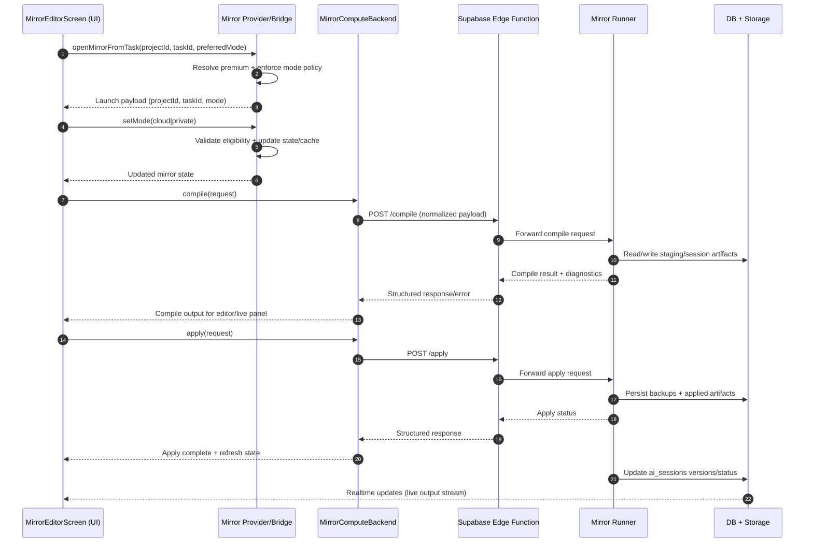

# Mirror Architecture

## Purpose
Mirror provides an assisted coding workspace inside the app, combining UI controls, provider-driven mode selection, backend compute execution, and persistent storage of session/version metadata.

This document describes the end-to-end runtime path and the key responsibilities per layer.

## Scope
The architecture in this document covers:

- Mirror Editor UI (`MirrorEditorScreen`)
- Mirror state and backend selection (`mirrorProvider`, `mirrorBackendProvider`)
- Compute backend contract (`MirrorComputeBackend`) and concrete backends
- Supabase Edge Function routing (`mirror_compute`)
- Runner execution service (cloud/local runner)
- Storage and session persistence (`ai_sessions`, staging/backup storage)

## Components

### UI Layer
- Entry points: task/project actions that deep-link to `MirrorEditorScreen`
- Main screen: `lib/features/mirror/mirror_editor_screen.dart`
- Responsibilities:
- Select mode (`private` or `cloud`)
- Show premium guard UX for restricted mode
- Display files/editor/terminal/live output
- Forward user intent to provider/backend flow

### Provider Layer
- State provider: `lib/core/providers/mirror_provider.dart`
- Bridge provider: `lib/core/providers/ai_chat_provider.dart` (`openMirrorFromTask`)
- Responsibilities:
- Resolve premium status and mode eligibility
- Persist/restore mode and variant cache
- Select concrete backend implementation based on mode + premium
- Enforce fallback to safe mode when premium is missing

### Backend Contract Layer
- Contract: `lib/features/mirror/mirror_compute_backend.dart`
- Implementations:
- `cloud_fly_backend.dart`
- `edge_function_backend.dart`
- `private_grpc_backend.dart`
- Responsibilities:
- Normalize compile/apply requests
- Perform retries/error mapping
- Handle patch/apply/backup helpers where applicable

### Edge Layer
- Function: `supabase/functions/mirror_compute/index.ts`
- Responsibilities:
- Validate request/auth context
- Forward compile/apply requests to runner endpoint
- Enforce timeouts and return structured errors

### Runner Layer
- Services:
- `server/mirror-cloud-runner/lib/main.dart`
- `server/mirror-local-runner/lib/main.dart`
- `server/mirror-shared/lib/http_gateway.dart`
- Responsibilities:
- Receive compile/apply requests
- Resolve and compile project inputs
- Return output artifacts, logs, and diagnostics
- Emit operational logs and enforce cleanup policy

### Storage Layer
- Database:
- `ai_sessions` table for session status and versions
- Storage buckets (staging/signed-inputs/backups)
- Responsibilities:
- Persist mirror session states and generated versions
- Retain artifacts for apply/restore flows
- Enforce RLS/policy boundaries

## Data Contracts

### Compile Request (logical)
- `projectId`
- `taskId`
- `mode`
- `files` or source references
- optional execution metadata

### Compile Response (logical)
- status/result
- output versions/artifacts
- diagnostics or structured error

### Apply Request (logical)
- selected version/patch
- apply strategy metadata
- backup directive (if enabled)

### Apply Response (logical)
- apply status
- backup reference (if created)
- resulting artifact/session update

## Runtime Sequence

## Control Flow Notes
- Mode control is provider-first. UI reflects provider state; provider enforces policy.
- Cloud mode must pass premium checks before backend selection remains cloud.
- Backend classes abstract transport details, so UI does not depend on edge/runner protocol changes.
- Realtime output is session-driven and should remain capped client-side to avoid unbounded UI memory.

## Reliability and Safety
- Use retries with bounded backoff for transient edge/runner failures.
- Return typed/structured errors from edge and backend to keep UI decisions deterministic.
- Fail closed on missing critical runner secrets.
- Keep artifact cleanup/lifecycle jobs active to avoid storage growth.

## Security Boundaries
- UI does not decide authorization; provider/backend/edge must enforce it.
- Edge validates auth context and forwards only authorized requests.
- Storage access is policy-protected (owner-scoped paths and RLS).
- Premium entitlement should have a single source of truth across provider/backend selection.

## Extension Points
- Add additional modes (for example `team`) by extending provider mode policy and backend mapping.
- Add richer diff/apply strategies in backend contract without changing UI entry points.
- Add telemetry hooks at provider/backend/edge boundaries for latency and failure analysis.

## Operational Checklist
- Confirm edge endpoint contract matches active backend implementation.
- Confirm runner environment secrets are set and no insecure defaults are used.
- Confirm storage buckets and policies exist for signed-inputs/backups.
- Confirm realtime update filters include project/task scope.
- Confirm test coverage includes premium gating, mode switching, and output capping.
